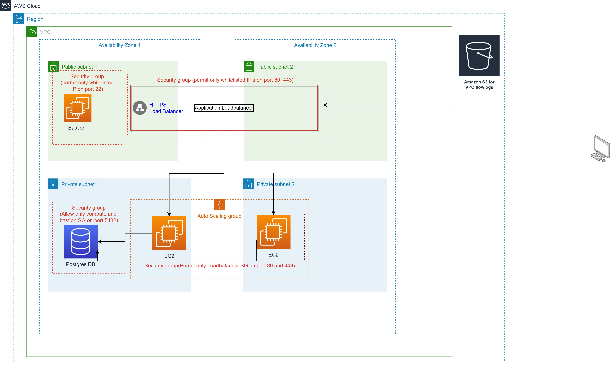

# greylog-stack
Implementation of Cloud engineering challenge for Greylog

## Structure
This git repository contains implementation for the greylog chanllege.
The terraform modules created are in this [location](./modules):
    - [networking](./modules/networking)
    - [compute](./modules/compute)
    - [database](./modules/database)
The terraform workspace created is in this [location](./workspace)
    - [sandbox](./workspace/sandbox)

## Documentation
To view documentation on each module, please visit the readme.md file located in each module

T0 view documentation on how to run the terraform scripts, please visit the [sandbox](./workspace/sandbox) workspace and read the readme.md

## Architectural diragram
